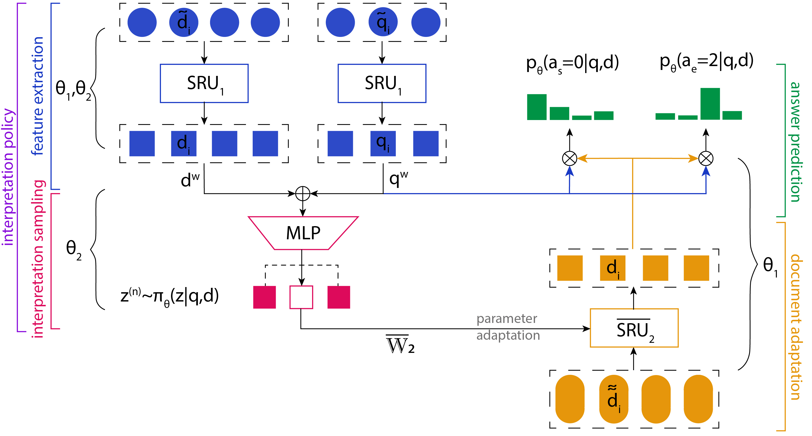
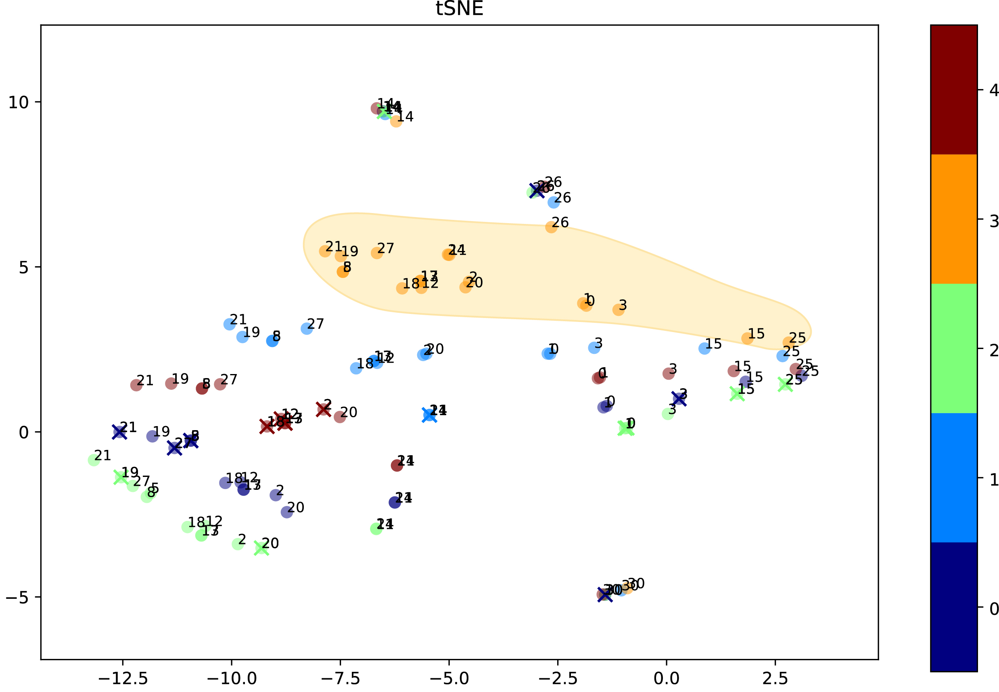

# APIP
Latent Question Interpretation using a module that Adapts Parameters through Interpretation Policy

In this work we propose a training framework and a neural network architecture for learning multiple question interpretations during the question answering procedure.
<p align="center">
<br>
<i><sub>Structure overview of integrated APSN module with DrQA. In this illustration number of interpretations is 2 and a sampled interpretation is 1.</sub></i><br>
</p>


|| <sub>Answers from the APIP model produced by inducing the value of a latent interpretation and other competitive methods, given the manually constructed document</sub>|
| --- | --- |
| `D` | <sub>Maria had a big lunch today. She ate a sandwich. Maria ate a salad with coffee. Finally, she wandered into a store and ate an ice cream.</sub>|
| `Q` | <sub>What did Maria eat for lunch ?</sub>|
| `A` | <sub>['sandwich', 'salad with coffee', 'ice cream']</sub> |
| `APIP` | <sub>['ice cream', 'sandwich', 'salad']</sub> |
| `Other` | <sub>`Mnemon`: ['a sandwich'], `QANet`: ['coffee'], `R-Net`, `DrQA`: ['a sandwich']</sub> |
|||
| `D` | <sub>Parrot have learned how to reproduce human language. The Bird speaks Japanese now. In fact, the parrot speaks Russian too. And of course, british owner taught this bird how to speak English.</sub>|
| `Q` | <sub>What languages does parrot speak ? </sub>|
| `A` | <sub>['Japanese', 'Russian', 'English']</sub> |
| `APIP` | <sub>['Russian too', 'English', 'Japanese']</sub> |
| `Other` | <sub>`Mnemon`, `R-Net`, `DrQA`: ['Russian'], `QANet`: ['English']</sub> |
|||
| `D` | <sub>German language is wide spread in Europe. Obviously, it is mainly spoken in Germany. Moreover, it is one of the used languges in Switzerland and Austria as well.</sub>|
| `Q` | <sub>In which countries German language is spoken ?</sub>|
| `A` | <sub>['Germany', 'Switzerland', 'Austria']</sub> |
| `APIP` | <sub>['Switzerland and Austria', 'Germany']</sub> |
| `Other` | <sub>`Mnemon`, `R-Net`, `DrQA`: ['Germany'], `QANet`: ['Switzerland and Austria']</sub> |
|||
| `D` | <sub>Alice was listening to Beatles yesterday. It was a sunny day, and the song "Come Together" fitted perfectly. Indeed, that song was very cheerful and bright.</sub>|
| `Q` | <sub>What kind of song was Alisce listening ? </sub>|
| `A` | <sub>['Come Together', 'cheerful', 'bright']</sub> |
| `APIP` | <sub>['Come Together', 'very cheerful and bright']</sub> |
| `Other` | <sub>`Mnemon`, `QANet`, `R-Net`, `DrQA`: ['Come Together']</sub> |
|||
| `D` | <sub>Bob keeps his postage marks in a case that is green colored. He have been collecting this marks since his childhood. The case is made of wood. The notable thing about it is that it is carved with waves.</sub>|
| `Q` | <sub>How does the Bob 's case look like ?</sub>|
| `A` | <sub>['wood', 'green', 'carved with waves']</sub> |
| `APIP` | <sub>['carved with waves', 'green colored', 'The case is made of wood']</sub> |
| `Other` | <sub>`Mnemon`, `QANet`, `R-Net`: ['wood'], `DrQA`: ['The case is made of wood']</sub> |
|||
| `D` | <sub>Africa has varied array of wild animals. The giraffes, the world's tallest animal, inhabit Africa. Also African elephants live here. The world's fastest land mammal, the cheetah, lives in Africa too.</sub>|
| `Q` | <sub>What animals live in Africa ? </sub>|
| `A` | <sub>['giraffes', 'elephants', 'cheetah']</sub> |
| `APIP` | <sub>['African elephants', 'giraffes', 'cheetah']</sub> |
| `Other` | <sub>`Mnemon`: ['the cheetah'], `QANet`: ['African elephants'], `R-Net`: ['wild animals'], `DrQA`: ['giraffes']</sub> |
|||
| `D` | <sub>It is well known that dry air is mainly made up of nitrogen (78.09%) and oxygen (20.95%). However, many of us could not imagine that the rest of dry air is made of argon, carbon dioxide and other trace gases (0.94%).</sub>|
| `Q` | <sub>What does dry air comprise ?</sub>|
| `A` | <sub>['nitrogen', 'oxygen', 'argon', 'carbon dioxide', 'trace gases']</sub> |
| `APIP` | <sub>['argon, carbon dioxide and other trace gases', 'nitrogen']</sub> |
| `Other` | <sub>`Mnemon`, `QANet`, `R-Net`,`DrQA`: ['nitrogen']</sub> |
|||
| `D` | <sub>Manager was late for work and his boss was angry about it. It is because at first manager went to a bank. Then manager went to a friends house. Eventually, a manager went to the cafe.</sub>|
| `Q` | <sub>Where did manager go before the work ?</sub>|
| `A` | <sub>['bank', 'friend house', 'cafe']</sub> |
| `APIP` | <sub>['a friends house', 'the cafe']</sub> |
| `Other` | <sub>`Mnemon`, `R-Net`, `DrQA`: ['the cafe'], `QANet`: ['cafe']</sub> |
|||
| `D` | <sub>Pulp Fiction is a an American crime film by Quentin Tarantino. In the movie Uma Thurman played Mia. Another main role was given to John Travolta. And lastly, Samuel Jackson also played in the movie and it elevated his career.</sub>|
| `Q` | <sub>Who took a part in the movie ?</sub>|
| `A` | <sub>['Thurman', 'Jackson', 'Travolta']</sub> |
| `APIP` | <sub>['Samuel Jackson', 'Uma Thurman', 'John Travolta']</sub> |
| `Other` | <sub>`Mnemon`: ['Uma Thurman played Mia. Another main role was given to John Travolta'], `QANet`, `R-Net`, `DrQA`: ['Samuel Jackson']</sub> |
|||
| `D` | <sub>Town A is located 150 km away from town B. The towns are connected via rail system. A journey between these towns takes around 1 hour by train.</sub>|
| `Q` | <sub>How far are the two towns from each other ?</sub>|
| `A` | <sub>['150 km', '1 hour by train']</sub> |
| `APIP` | <sub>['150 km', 'around 1 hour by train', 'around 1 hour']</sub> |
| `Other` | <sub>`Mnemon`: ['150 km'], `QANet`, `DrQA`: ['1 hour'], `R-Net`: ['150 km away']</sub> |

Tested on GeForce GTX Titan X.

## Setup
**GPU and CUDA 8 are required**

#### Install
 
 - Python >= 3.5 
 - [PyTorch](http://pytorch.org/)
 - CuPy, pynvrtc
 - Spacy 1.10.1
 - Cython, Pandas, NumPy, Scikit-learn
 - msgpack, tensorboardX, Matplotlib
 
 #### Download 
 
 - the [SQuAD](https://rajpurkar.github.io/SQuAD-explorer/)
 - GloVe word vectors 
 - [Sent2vec](https://github.com/epfml/sent2vec) with wiki_bigram.bin 
 - Use checkpoints [`init1`, `init2`](https://drive.google.com/file/d/1eSekrHzmZ-39pSOf-1J6ReWZqNKGW5Xc/view?usp=sharing) to initialize models for training; [`m1`, `m2`](https://drive.google.com/file/d/1eSekrHzmZ-39pSOf-1J6ReWZqNKGW5Xc/view?usp=sharing) for testing
 - Comparison of APIP flavors: [`details`](https://drive.google.com/open?id=1YZWX3xWZWyzX9HiiSYn2DpJAPkD430pa) and [`checkpoints`](https://drive.google.com/file/d/1OqS32mxCoXg4eWDkR5OnwB5e4wv9qLXb/view?usp=sharing)
 
 using `bash download.sh`
 
 #### Preprocess Dataset
 ```bash
# prepare the data
python prepro.py

# prepare semi-supervised labels for question-answer pairs
python semisup_labels.py

# make sure CUDA lib path can be found, e.g.:
export LD_LIBRARY_PATH=/usr/local/cuda/lib64
```

## Running Code
 ```bash
# training in semi-supervised VAE framework
python train.py -e 240 -bs 50 -rd init2 -rs best_model.pt -lr  0.0005 --pi_q_rnn pi_d_nqd --control_d sru_00_kconv5_gram_s_cos --critic_loss --n_actions 5 --vae --semisup --rl_start 80 --rl_tuning pg

# sample answers with induced values for interpretations
python interpret.py -bs 32 -rd m1 -rs best_model.pt --pi_q_rnn pi_d_nqd --control_d sru_00_kconv5_gram_s_cos --n_actions 5 --vae

# visualize document encodings with interpretation-adapted parameters
python tsne.py -bs 1 -rd m1 -rs best_model.pt --pi_q_rnn pi_d_nqd --control_d sru_00_kconv5_gram_s_cos --n_actions 5 --vae

# get scores for F1 Threshold(rho) experiments for APIP 
python f1_thresh_apip.py -bs 100 -rd m1 -rs best_model.pt -lr  0.00015 --pi_q_rnn pi_d_nqd --control_d sru_00_kconv5_gram_s_cos --critic_loss --n_actions 5 --vae

# produce answers for different values of interpretation on SQuAD dev set
python text_interpret.py -bs 100 -rd m1 -rs best_model.pt -lr  0.00015 --pi_q_rnn pi_d_nqd --control_d sru_00_kconv5_gram_s_cos --critic_loss --n_actions 5 --vae

# get answers from APIP on manual samples
python text_test.py -bs 100 -rd m1 -rs best_model.pt -lr  0.00015 --pi_q_rnn pi_d_nqd --control_d sru_00_kconv5_gram_s_cos --critic_loss --n_actions 5 --vae
 ```
 <p align="center">
<br>
<i><sub>Indices represent different documents, colors correspond to induced interpretations (interpretation marked with cross was chosen by the policy during testing)</sub></i><br>
</p>

|| <sub>Sample answers produced by inducing the value of a latent interpretation given `D, Q` from SQuAD</sub>|
| --- | --- |
| `D` | <sub>ITV Tyne Tees was based at City Road for over 40 years after its launch in January 1959.<br>In 2005 it moved to a new facility on The Watermark business park next to the MetroCentre in Gateshead.</sub>|
| `Q` | <sub>Where did ITV Tyne Tees move in 2005?</sub>|
| `A` | <sub>[’a new facility’]</sub> |
| `APIP` | <sub>['The Watermark business park', 'Gateshead']</sub> |
|||
| `D` | <sub>Research shows that student motivation and attitudes towards school are closely linked to student-teacher<br> relationships. Enthusiastic teachers are particularly good at creating beneficial relations with their students.</sub>|
| `Q` | <sub>What type of relationships do enthusiastic teachers cause?</sub>|
| `A` | <sub>[’beneficial’]</sub> |
| `APIP` | <sub>['student-teacher', 'beneficial relations']</sub> |
|||
| `D` | <sub>For Luther, also Christ’s life, when understood as an example, is nothing more than an illustration<br>of the Ten Commandments, which a Christian should follow in his or her vocations on a daily basis.</sub>|
| `Q` | <sub>What should a Christian follow in his life?</sub>|
| `A` | <sub>[’Ten Commandments’]</sub> |
| `APIP` | <sub>['Ten Commandment', 'vocations on a daily basis']</sub> |
|||
| `D` | <sub>It is believed that the civilization was later devastated by the spread of diseases from Europe,<br>such as smallpox.</sub>|
| `Q` | <sub>What was believed to be the cause of devastation to the civilization?</sub>|
| `A` | <sub>[’spread of diseases from Europe’]</sub> |
| `APIP` | <sub>['smallpox', 'spread of diseases from Europe']</sub> |

## Credits
Author of the Document Reader model: [@danqi](https://github.com/danqi)

Pytorch implementation of DrQA with SRU cells [@taolei87](https://github.com/taolei87/sru/tree/master/DrQA)

